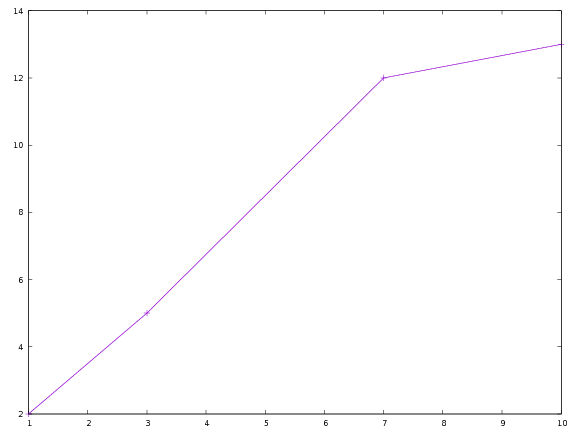

<center><h1>Notes on the plot command</h1></center>

A commonly-used plotting tool for Linux is `gnuplot`. However, it is more complicated than we need, and has more features than we need, so I've written an interface to it simply called `plot`. To use it, first 
prepare a data file containing the data you want to plot. Most of the time you'll be doing this using your own code and the output redirection operator `>`, but you can also do it by just creating a file in a 
text editor with the data to be plotted in two columns, like so:


1 2
3 5
7 12
10 13


Suppose you save that file and call it `data.txt`. You can then make a plot of those data by typing `plot data.txt`.

You'll see the following:



## Plotting multiple files

If you have multiple data files you want to plot, you can do `plot file1.txt file2.txt ...` `Plot` will plot them all on the same set of axes in different colors.

## Plot options

You can pass options to plot to do a couple of different things:

### Log-log plots

Use the `-l` switch to plot data on a log-log scale:

```
plot -l scaling.txt
```

### Labelling things

Use the `-lx` and `-ly` options to specify labels for the axes, and `-t` to title the graph. If your labels or titles are more than one word long, put them in quotes.

```
plot -lx Time -ly Snowfall -title "Snowfall vs. Time"
```

Note that `-xl` and `-yl` work too, so you don't have to remember which way it goes.

### Making PDF's

Ultimately, you'll need to save your plots to turn them in. Use the `-o` option, like you do for the compiler:

```
plot -lx Time -ly "Covfefe Quotient" -t "Covfefe vs. Time" -o covfefe.pdf
```


